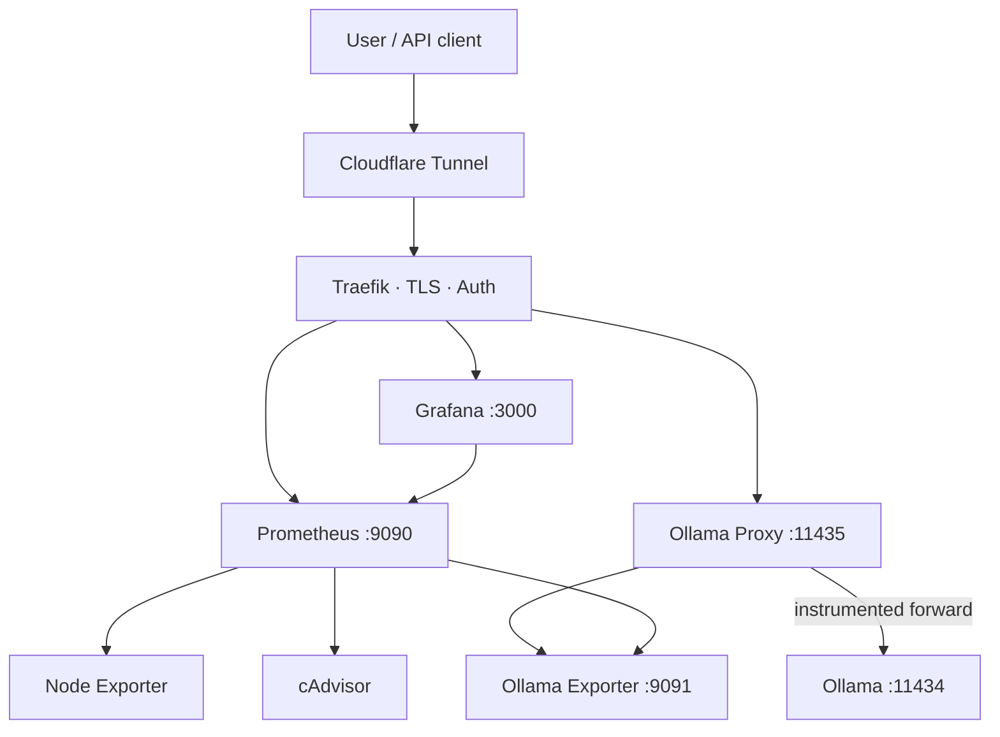

# AI Control Plane

<p>


</p>

**Self-hosted AI infrastructure that deploys in minutes.** One-command rollout of a production-grade local LLM platform with TLS, monitoring, and zero open ports — Cloudflare Tunnel routes everything, Traefik handles internal routing, Grafana watches it, Ollama serves it. Built for people who want their AI stack on their own metal without the YAML rabbit hole.



---

## 📢 Latest Update: PHASE 3 ✅ Security & Admin Dashboard

🔐 **Security Hardening:**
- ✅ Grafana & Prometheus now internal-only (no public routes)
- ✅ Built-in admin dashboard at `/admin/dashboard.html`
- ✅ SSH tunnel access guide for secure remote operations
- ✅ [INTERNAL_ACCESS.md](INTERNAL_ACCESS.md) — Comprehensive access documentation

📊 **Admin Dashboard Features:**
- Real-time metrics (requests/sec, latency, error rate)
- System health status
- Auto-refreshing every 3 seconds
- No auth required (consider adding for production)

**See:** [PHASE3_COMPLETE.md](PHASE3_COMPLETE.md) for full technical details

---

**Previous:** PHASE 2 — Production Installer ([PHASE2_README.md](PHASE2_README.md))
## 🎯 For Users

**👉 [Start here: PRODUCT.md](PRODUCT.md)** — User-friendly overview and quick start guide.

### Quick Start
```bash
bash install/install.sh
```

That's it. Open `https://app.<your-domain>` when done.

---

## 🔧 For Developers

Want to understand the stack or customize it? This section is for you.

### Technical Architecture

### Prerequisites
- Docker + Docker Compose (`docker-compose --version`)
- Cloudflare account with a domain
- Cloudflare Tunnel setup

### 1. Clone & Configure

```bash
git clone https://github.com/gururajseethur/self-hosted-ai-infrastructure.git
cd self-hosted-ai-infrastructure

# Create .env from template
cp .env.template .env

# Edit and configure
nano .env
```

**Required in `.env`:**
```bash
CLOUDFLARE_TUNNEL_TOKEN=<your-token>
DOMAIN=gururajseethur.in
GRAFANA_ADMIN_PASSWORD=<strong-password>
TRAEFIK_CERTIFICATESEMAIL=admin@gururajseethur.in
```

### 2. Deploy

```bash
chmod +x scripts/*.sh
./scripts/deploy.sh
```

### 3. Access Dashboard

```
https://dashboard.gururajseethur.in
Username: admin
Password: (from .env)
```

---

## 🏗️ Architecture

```
┌─────────────────────────────────────────────────┐
│  Cloudflare Tunnel (cloudflared)                │
└──────────────────┬──────────────────────────────┘
                   │
        ┌──────────▼──────────┐
        │  Traefik (Port 80/443)
        │  - Reverse Proxy
        │  - TLS Termination
        │  - Label Routing
        └──────────┬──────────┘
                   │
        ┌──────────┼─────────────────────────┐
        |          |                         |
   ┌────▼──┐  ┌───▼──┐  ┌────────────────┐ |
   │Grafana│  │Prom. │  │Ollama API      │ |
   │:3000  │  │:9090 │  │:11434         │ |
   └───────┘  └──┬───┘  └────────────────┘ |
               │                            │
        ┌──────▼──────────┐      ┌──────────▼──────┐
        │Scrape Targets:  │      │Ollama Exporter  │
        ├─ Node Exporter  │      │(Custom):9091    │
        ├─ cAdvisor       │      └─────────────────┘
        └─────────────────┘

All services isolated in Docker network (infra).
Volumes: prometheus_data, grafana_data, ollama_data (persistent).
```

---

## 📊 Dashboards & Access

| Service | URL | Auth | Port | Notes |
|---------|-----|------|------|-------|
| **Grafana Dashboard** | `https://dashboard.gururajseethur.in` | Username/Pass | 3000 | Main observability hub |
| **Prometheus** | `https://prometheus.gururajseethur.in` | Basic Auth (admin:admin) | 9090 | Metrics storage & querying |
| **Ollama API** | `https://ollama.gururajseethur.in` | Basic Auth | 11434 | ⚠️ Direct use NOT recommended |
| **Ollama Proxy** | `https://ollama-proxy.gururajseethur.in` | Basic Auth | 11435 | ✅ **Recommended** (auto-metrics) |

### Ollama Access Strategy

**Option A: Via Ollama Proxy (Recommended)**
```bash
# All requests automatically instrumented + metered
curl -X POST http://ollama-proxy:11435/api/generate \
  -H "Content-Type: application/json" \
  -d '{"model":"gpt-4o-mini","prompt":"hello"}'
```

Benefits:
- ✅ Automatic per-model request counting
- ✅ Latency tracking (p50, p95, p99)
- ✅ Error rate visibility
- ✅ No app code changes required
- ✅ Transparent request forwarding (same API as Ollama)

**Option B: Direct Ollama (Manual Metrics)**
```bash
# If you POST metrics to exporter /observe endpoint manually
curl -X POST http://ollama:11434/api/generate \
  -H "Content-Type: application/json" \
  -d '{"model":"gpt-4o-mini","prompt":"hello"}'

# Then manually record:
# curl -X POST http://ollama-exporter:9091/observe \
#   -H "Content-Type: application/json" \
#   -d '{"model":"gpt-4o-mini","event":"done","duration":0.42,"success":true}'
```

**Recommendation**: Use Ollama Proxy for all new deployments and client apps.

All HTTPS via Cloudflare Tunnel. No direct port exposure.

---

## 🎯 Metrics Exported

### Host Metrics (Node Exporter)
- CPU usage (per core + average)
- Memory (free, available, used, percent)
- Disk I/O (reads, writes, latency)
- Network traffic (bytes in/out, errors, dropped)
- Load average, uptime
- Process-level stats

### Container Metrics (cAdvisor)
- Memory usage per container
- CPU usage per container
- Network I/O per container
- Block I/O per container
- Restart counts

### Ollama Custom Metrics
- `ollama_api_health` (1=up, 0=down)
- `ollama_models_loaded` (count)
- `ollama_requests_in_flight` (current requests)
- `ollama_request_duration_seconds` (histogram by model)
- `ollama_requests_total` (counter by model, status: success/error)

**Note**: Metrics are automatically recorded when using **Ollama Proxy** (recommended).
If accessing Ollama directly, manually POST to `/observe` endpoint on the exporter.

---

## 🚀 Operations

### Start All Services
```bash
./scripts/deploy.sh
```

### Check Status
```bash
./scripts/status.sh
```

### View Logs
```bash
docker-compose logs -f                # All services
docker-compose logs -f ollama         # Specific service
docker-compose logs -f --tail=100     # Last 100 lines
```

### Restart Services
```bash
./scripts/restart.sh                  # All services
docker-compose restart grafana        # Specific service
```

### Stop All Services (preserve data)
```bash
./scripts/stop.sh
```

### Destroy Everything (WARNING)
```bash
docker-compose down -v                # Remove volumes too
```

---

## 🔄 Updates & Rollback

### Update Images
```bash
docker-compose pull
docker-compose up -d
```

### Rollback (Git)
```bash
git log --oneline | head -10
git revert <commit-hash>
./scripts/deploy.sh
```

### Backup Prometheus Data
```bash
docker run --rm -v self-hosted-ai-infrastructure_prometheus_data:/data \
  -v /backup:/backup \
  alpine tar czf /backup/prometheus-$(date +%Y%m%d).tar.gz -C /data .
```

---

## 🔐 Security

### Authentication
- **Grafana**: Username/password (config in .env)
- **Prometheus**: Basic auth via Traefik middleware
- **Ollama**: Basic auth via Traefik middleware
- **All HTTP**: Redirects to HTTPS

### Network Isolation
- Internal Docker network (`infra`)
- No ports exposed to host network
- All external access: Cloudflare Tunnel only

### Secrets Management
- `.env` excluded from Git (use `.env.template`)
- Traefik ACME certs stored in `config/traefik/acme.json` (protected)
- Volumes have restricted permissions

### TLS/SSL
- Let's Encrypt (via Traefik)
- Auto-renewal
- Modern ciphers only (TLS 1.2+)

---

## � Ollama Instrumentation Proxy

The Ollama Proxy automatically records metrics without requiring changes to your application code.

### How It Works

```
Your App → Ollama Proxy (11435)
               ↓ (extracts model name, records "start")
           Ollama Backend (11434)
               ↓ (records "done", duration, status)
           Ollama Exporter (9091)
               ↓
           Prometheus (stores metrics)
               ↓
           Grafana (visualizes)
```

### When to Use Proxy vs Direct Ollama

| Use Case | Endpoint | Auto-Metrics? | Notes |
|----------|----------|---------------|-------|
| Production apps | `ollama-proxy:11435` | ✅ Yes | Recommended |
| Low-overhead direct access | `ollama:11434` | ❌ No (manual) | Skip instrumentation |
| Debugging/dev | Either | Depends | Proxy has minimal overhead |

### Integration Guide

#### For New Apps: Use Proxy
Replace `ollama:11434` with `ollama-proxy:11435` in your code:

```python
# Python example
import requests

# OLD (no metrics)
# response = requests.post('http://ollama:11434/api/generate', ...)

# NEW (auto-metrics)
response = requests.post('http://ollama-proxy:11435/api/generate', json={
    'model': 'gpt-4o-mini',
    'prompt': 'hello world'
})
```

```bash
# Bash example
curl -X POST http://ollama-proxy:11435/api/generate \
  -H "Content-Type: application/json" \
  -d '{"model":"gpt-4o-mini","prompt":"hello"}'
```

#### For Existing Apps: Two Options

**Option 1: Proxy (No Code Changes)**
- Change connection string: `ollama:11434` → `ollama-proxy:11435`
- Metrics appear automatically in Grafana

**Option 2: Manual Instrumentation (Advanced)**
- Keep using `ollama:11434` directly
- Add POST calls to `ollama-exporter:9091/observe`:
  ```python
  # At request start:
  requests.post('http://ollama-exporter:9091/observe', json={
      'model': 'gpt-4o-mini',
      'event': 'start'
  })
  
  # At request end:
  requests.post('http://ollama-exporter:9091/observe', json={
      'model': 'gpt-4o-mini',
      'event': 'done',
      'duration': elapsed_seconds,
      'success': True  # or False if error
  })
  ```

### Proxy Assumptions & Limitations

- **Model name extraction**: Proxy looks for `"model"` key in JSON request body. Ollama API uses this consistently.
- **Exporter downtime**: If exporter is unavailable, proxy still works (metrics not recorded, best-effort).
- **Request/response streaming**: Proxy supports full streaming in both directions.
- **Connection errors**: Transparently forwarded to client with proper HTTP status codes.
- **Timeout handling**: Default 60s timeout (configurable via `REQUEST_TIMEOUT` env var).

### Proxy Performance

- Built on Flask + Gunicorn (4 workers)
- Minimal overhead (~1-5ms per request for instrumentation)
- Suitable for moderate-to-high throughput
- For ultra-high demand, upgrade to async framework (Quart) or horizontal scale

### Testing the Proxy

```bash
# After deploying, run the test script
./scripts/test-proxy.sh

# Or manually test proxy endpoint
docker compose exec ollama-proxy curl http://localhost:11435/health

# Test instrumentation
docker compose exec ollama-exporter curl -X POST -H 'Content-Type: application/json' \
  -d '{"model":"test","event":"start"}' http://localhost:9091/observe

# View metrics
docker compose exec prometheus curl http://localhost:9090/api/v1/query?query=ollama_requests_total
```

---


### 1. Create Tunnel in Cloudflare Dashboard
```
https://dash.cloudflare.com/
→ Access → Tunnels → Create Tunnel
→ Name: gururaj-infra-control
→ Copy the TOKEN
```

### 2. Update `.env`
```bash
CLOUDFLARE_TUNNEL_TOKEN=eyJhIjov...
```

### 3. Route to Tunnel
In Cloudflare DNS dashboard:
```
Type: CNAME
Name: *.gururajseethur.in (wildcard)
Target: <tunnel-uuid>.cfargotunnel.com
```

### 4. Deploy
```bash
./scripts/deploy.sh
```

The tunnel automatically connects. Verify:
```bash
docker logs cloudflared
```

---

## 💰 Monetization Strategy

This platform is designed for:

### 1. **Managed Intelligence Control** (SaaS)
- Host this on your VPS/server
- White-label Grafana dashboards
- Charge per customer ($X/month)

### 2. **AI/Ollama as a Service**
- Expose Ollama endpoint (auth-protected)
- Monitor usage per customer
- Bill by requests/tokens

### 3. **Infrastructure Observability**
- Sell to SMBs/home labs
- Offer setup + monitoring ($Y one-time)
- Support ($Z/month)

### Ready-Made Features
- ✅ Multi-tenant capablity (add tenant dashboards)
- ✅ Usage tracking (Prometheus metrics)
- ✅ Auth enforcement (Traefik middleware, Grafana RBAC)
- ✅ Portable (runs anywhere)
- ✅ Repeatable (IaC from Git)

---

## 📁 Folder Structure

```
self-hosted-ai-infrastructure/
├── docker-compose.yml           # Main orchestration
├── .env.template                # Config template (commit)
├── .env                          # Your config (don't commit)
├── .gitignore                    # Exclusions
├── README.md                     # This file
│
├── config/
│   ├── prometheus/
│   │   └── prometheus.yml        # Scrape config + retention
│   ├── traefik/
│   │   ├── traefik.yml           # Reverse proxy config
│   │   ├── dynamic.yml           # TLS + auth middleware
│   │   └── acme.json             # Let's Encrypt certs (auto)
│   └── grafana/
│       └── provisioning/
│           ├── datasources/
│           │   └── prometheus.yml # Grafana data source
│           └── dashboards/
│               ├── dashboards.yml # Provisioning config
│               └── unified-control-center.json # Main dashboard
│
├── exporter/
│   ├── ollama/
│   │   ├── Dockerfile            # Build custom exporter
│   │   ├── app.py                # Prometheus client + Flask metrics server
│   │   └── requirements.txt       # Python deps (prometheus-client, Flask)
│   └── ollama-proxy/
│       ├── Dockerfile            # Build proxy (gunicorn + Flask)
│       ├── app.py                # Instrumentation proxy (forwards + meters)
│       └── requirements.txt       # Python deps (Flask, requests, gunicorn)
│
├── scripts/
│   ├── deploy.sh                 # Init & start
│   ├── stop.sh                   # Graceful shutdown
│   ├── restart.sh                # Restart all
│   └── status.sh                 # Health check
│
└── .github/
    └── workflows/
        └── (CI/CD templates)
```

---

## 🐛 Troubleshooting

### Services Not Starting
```bash
docker-compose logs -f
docker-compose ps              # Check state (Restarting?)
docker-compose restart         # Retry
```

### Tunnel Not Connecting
```bash
docker logs cloudflared        # Check tunnel logs
docker-compose down cloudflared
docker-compose up -d cloud flared
```

### Dashboard Not Loading
1. Wait 2 minutes (Grafana cold start)
2. Check Prometheus datasource: Settings → Data Sources
3. Verify firewall: `docker ps` should show all services running

### High Memory/CPU
```bash
docker stats                   # Identify heavy container
# Edit docker-compose.yml memory limits (if needed)
docker-compose restart SERVICE_NAME
```

---

## 📚 Advanced Topics

### Adding Custom Exporters
1. Create exporter in `exporter/`
2. Add service to `docker-compose.yml`
3. Add scrape config to `prometheus.yml`
4. Deploy: `./scripts/deploy.sh`

### Multi-Machine Monitoring
- Deploy this on one server (primary)
- Install Node Exporter on other machines
- Add hosts to `prometheus.yml` scrape config
- Single pane of glass for all machines

### Alerting (Future)
- Configure AlertManager in Prometheus
- Define alert rules (`prometheus.yml > rule_files`)
- Send alerts to Slack/PagerDuty via Grafana

### Backups
```bash
# Automated daily backups (add to crontab)
0 2 * * * docker run --rm -v gururajseethur-infra_prometheus_data:/data \
  -v /backups:/backup alpine tar czf /backup/prom-$(date +%s).tar.gz -C /data .
```

---

## 📞 Support & Contribution

- Issues: GitHub Issues
- Docs: This README + inline comments
- Versioning: Semantic versioning (git tags)

---

## 📄 License

Proprietary. For internal use and future monetization.

---

## ✅ Deployment Checklist

- [ ] Domain registered & DNS in Cloudflare
- [ ] Cloudflare Tunnel created & token copied
- [ ] `.env` configured with all required values
- [ ] `./scripts/deploy.sh` executed successfully
- [ ] `docker-compose ps` shows all services running
- [ ] Dashboard accessible via HTTPS
- [ ] Prometheus scraping targets (check `/targets`)
- [ ] Ollama API responding (`curl https://ollama.gururajseethur.in/api/tags`)
- [ ] Backups configured (optional, but recommended)

---

**Built with ❤️ for portability, observability, and monetization.**
